---
fonts:
  mono: 'LXGWWenKaiGBScreenR'
  serif: 'LXGWWenKaiGBScreenR'
  sans: 'LXGWWenKaiGBScreenR'
  local: 'LXGWWenKaiGBScreenR'
layout: cover


lineNumbers: true

---

# 容器网络

从头搭建Docker桥接网络

<div class="uppercase text-sm tracking-widest">
增长后端 王若愚
</div>

<div class="abs-bl mx-14 my-12 flex">
  
  <div class="ml-3 flex flex-col text-left">
    <div><b>Share</b>Day</div>
    <div class="text-sm opacity-50">Jan. 15th 2024</div>
  </div>
</div>

---
layout: center

---
# 1、桥接网络

---

# 1、桥接网络概览

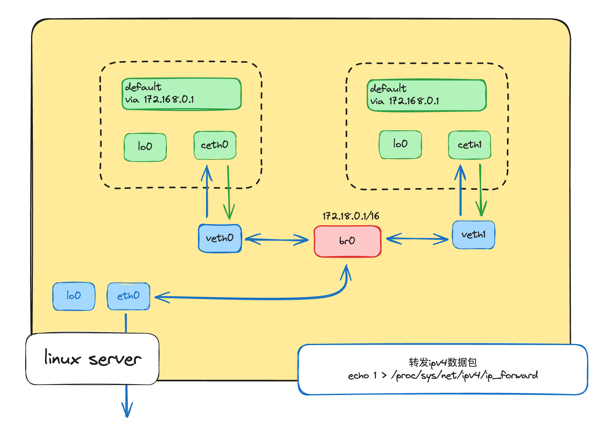

---

# 2、linux网络栈构成
<div class="grid grid-cols-3">
<div class="mt-8 col-span-1">
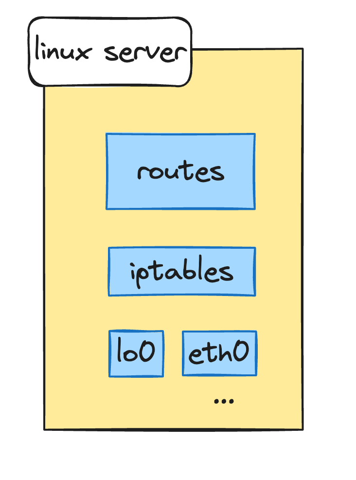
</div>
<div class="mt-8 col-span-2">
我们可以用命令查看一下:
```shell
#!/usr/bin/env bash
echo "# Network devices"
ip link list
echo -e "\n# Route table"
ip route list
echo -e "\n# iptables rules"
sudo iptables --list-rules
```
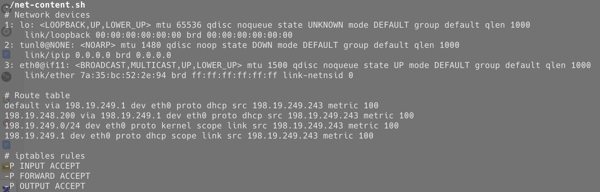
</div>
</div>

---

# 3、网络命名空间

 
#### 我们都知道docker的底层技术是由namespace和cgroup实现的, 其中namespace隔离PID、网络接口、文件系统、IPC等资源, cgroup能够限制和管理进程组的资源, 由于我们今天讨论的是docker网络, 所以我们只使用namesapce中网络隔离能力就好。
<div class="grid grid-cols-3">
<div class="mt-8 col-span-1">
1、创建我们的第一个网络命名空间
```shell
sudo ip netns add netns0
```
2、查看刚刚创建的netns
```shell
ip netns list
```
3、使用nsenter进入网络命名空间
```shell
nsenter --net=/run/netns/netns0 bash
```
</div>
<div class="mt-8 col-span-2 ml-4">
4、我们可以再看一下新的网络命令空间中网络栈信息
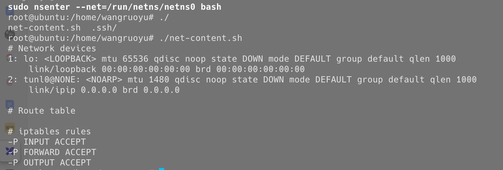
</div>
</div>

---

# 4、创建网络命名空间后网络概览

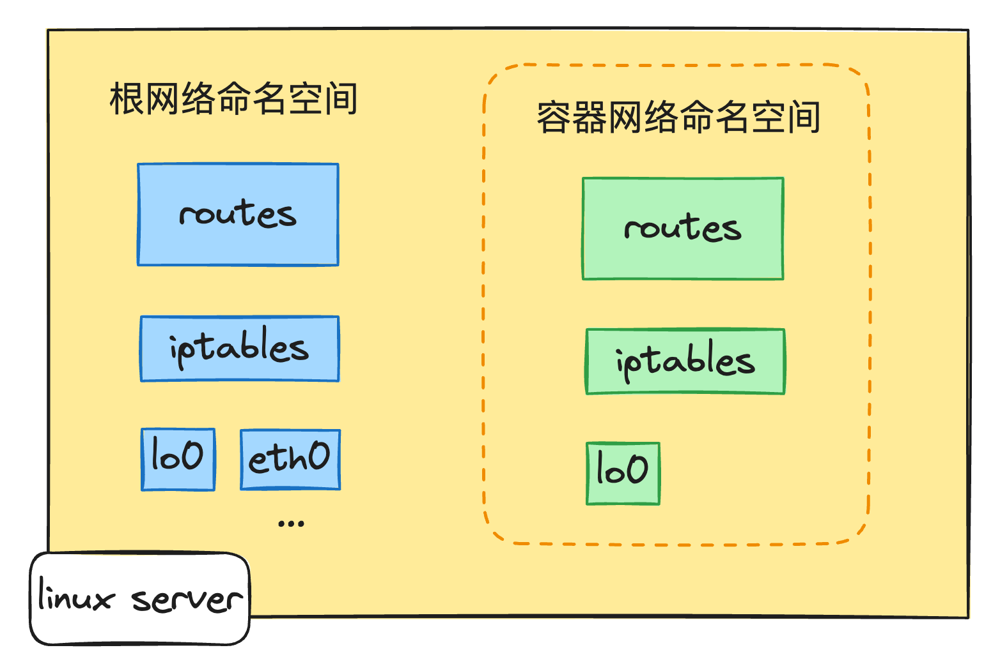


--- 

# 5、使用虚拟以太网设备（veth）连接到主机

##### 1、**从根网络命名空间**，让我们创建一对虚拟以太网设备：
```shell
sudo ip link add veth0 type veth peer name ceth0
```

##### 2、查看刚刚创建的虚拟涉别
```shell
ip link list
```
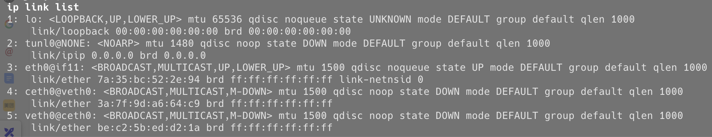

##### 3、分配设备，并启动veth0
```shell
ip link set ceth0 netns netns0 # 把ceth0放入netns0
sudo ip link set veth0 up # 启动veth0
sudo ip addr add 192.168.56.11/24 dev veth0 # 给veth0设置iP
```

---

# 5、使用虚拟以太网设备（veth）连接到主机

##### 4、进入netns

```shell
sudo nsenter --net=/run/netns/netns0 bash
```

##### 5、查看设备
```shell
ip link list
```
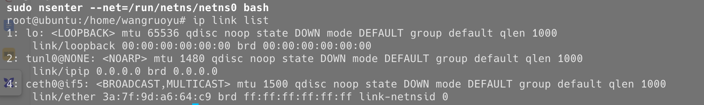

##### 6、启动ceth0
```shell
sudo ip link set lo up # 打开回环设备
sudo ip link set ceth0 up # 启动ceth0
sudo ip addr add 192.168.56.10/26 dev ceth0 # 给ceth0设置ip
```
---

# 5、使用虚拟以太网设备（veth）连接到主机

##### 7、从netns0 ping veth0
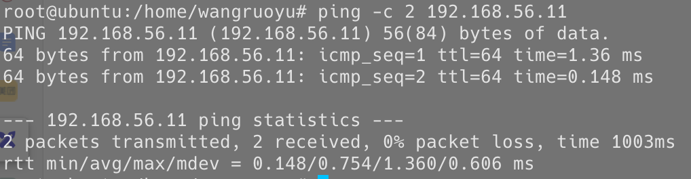

##### 8、从根网络命名空间ping ceth0
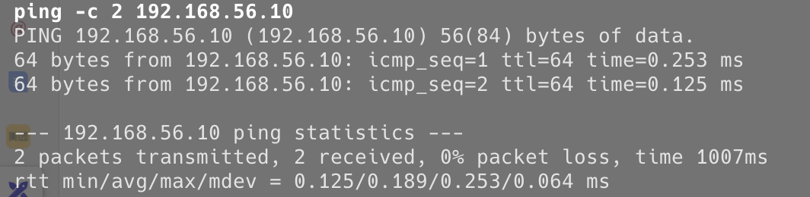

---

# 6、设置完虚拟设备网络概览

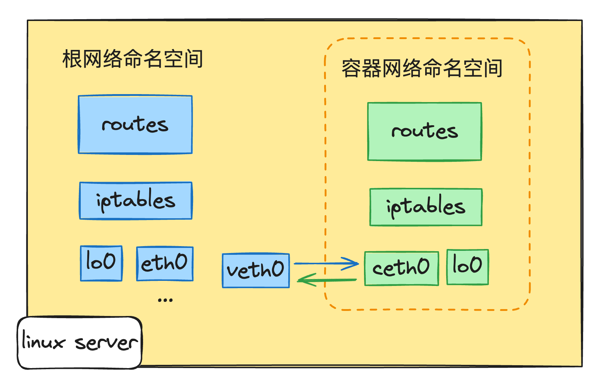

---

# 7、连接到其他设备

##### 在我们创建虚拟设备之前，使用ip link list命令看到有有一个eth0网络设备，我们从netns0连接到eth0吗？答案是不能。
```shell
ip addr show dev eth0
```
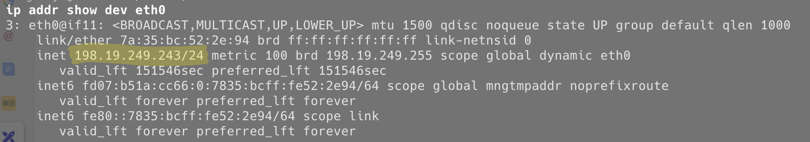

```shell
sudo nsenter --net=/run/netns/netns0 bash # 进入netns0
ping 198.19.249.243
```
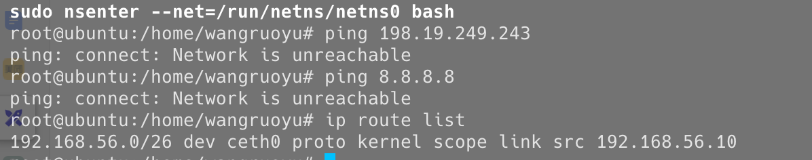


---

# 7、两个网络命名空间情况

我们重复之前的步骤：
```shell
sudo ip netns add netns1 # 创建netns1命名空间
sudo ip link add veth1 type veth peer name ceth1 # 创建虚拟设备
sudo ip link set veth1 up # 启动veth1
sudo ip addr add 192.168.56.21/24 dev veth1 # 给veth1设置ip
sudo ip link set ceth1 netns netns1 # 把ceth1放入netns1
```
进入netns1，进行设置:
```shell
sudo nsenter --net=/run/netns/netns1 bash # 进入netns1
sudo ip link set lo up # 启动回环设备
sudo ip link set ceth1 up # 启动ceth1
sudo ip addr add 192.168.56.20/24 dev ceth1 # 给ceth1设置ip
```
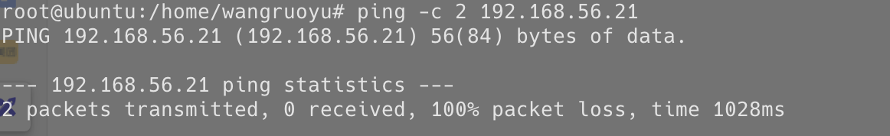

---

# 7、两个网络命名空间情况

##### 我们重复的经验好像不能用了，访问不到根命名空间了, 而且路由也是存在的
```shell
ip route list
192.168.56.0/24 dev ceth1 proto kernel scope link src 192.168.56.20
```

##### 我们切换到根命名空间试一试,也是ping不同的
```shell
ping -c 2 172.18.0.20
```
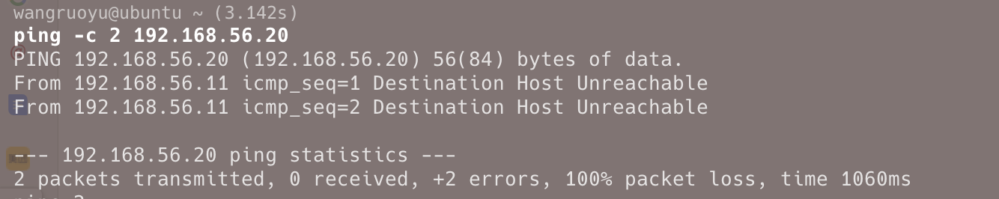

我们查看一下根命名空间的路由, 当我们添加一对虚拟设备时，会自动添加一条路由记录，这两条路由记录冲突了，当再第二个命名空ping的时候会选择第一条路由，当然找不到了
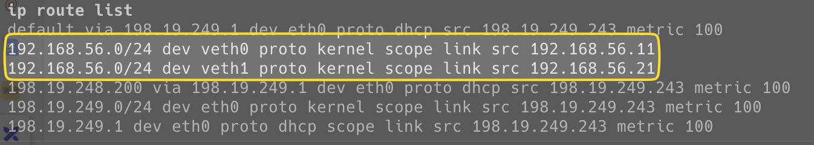

---

# 7、两个网络命名空间概览

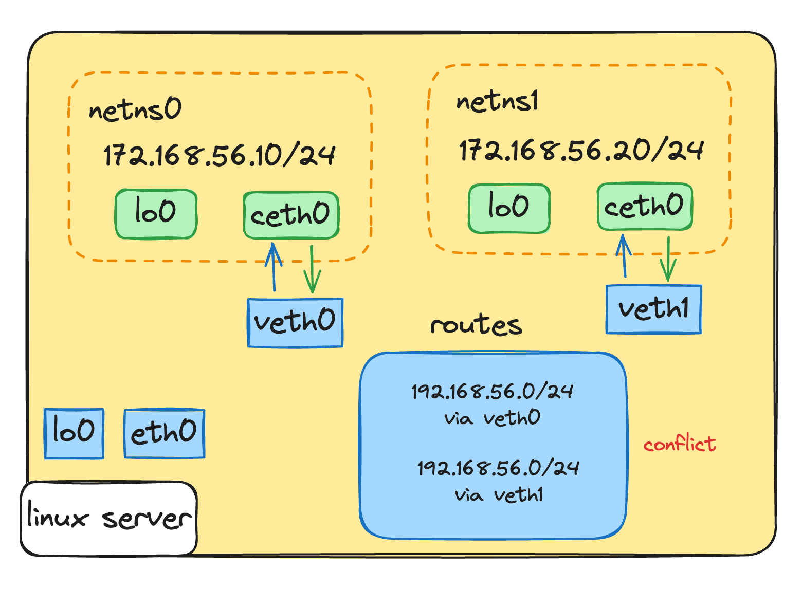

---

# 8、使用网桥连接两个命令空间
网桥是在二层运行的设备，根据mac地址通讯，不关心ip地址，所以用网桥可以解决路由冲突的问题。

<div class="grid grid-cols-2">
<div class="col-span-1">
1、首先需要删除之前创建的命名空间

```shell
sudo ip netns delete netns0
sudo ip netns delete netns1
```

2、在根命名空间里操作
```shell
sudo ip netns add netns0

sudo ip link add veth0 type veth peer name ceth0
sudo ip link set veth0 up
sudo ip link set ceth0 netns netns0
```
3、在netns0里操作
```shell
sudo nsenter --net=/run/netns/netns0 bash

sudo ip link set lo up
sudo ip link set ceth0 up
sudo ip addr add 192.168.56.10/16 dev ceth0
```
</div>
<div class="col-span-1 ml-4">
4、检查跟命名空间没有多余的路由
```shell
ip route list
```
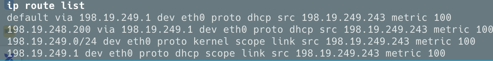
5、创建网桥


```shell
sudo ip link add br0 type bridge
sudo ip link set br0 up
```
6、连接虚拟设备
```shell
sudo ip link set veth0 master br0
sudo ip link set veth1 master br0
```
7、测试连接
```shell
sudo nsenter --net=/run/netns/netns0 ip neigh
sudo nsenter --net=/run/netns/netns0 ping -c 2 192.168.56.20
sudo nsenter --net=/run/netns/netns1 ping -c 2 192.168.56.10
```
</div>
</div>

---

# 9、使用网桥连接两个命令空间概览
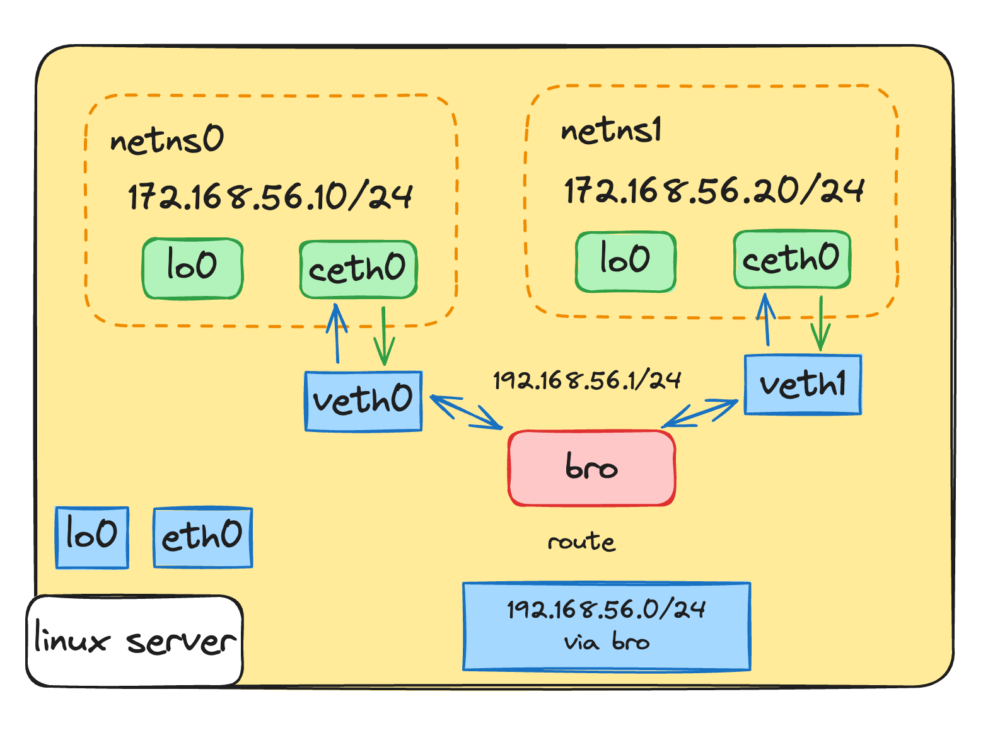


---

# 10、与外界联系

##### 我们现在容期间可以正常通信但是和主机还不能通信
```shell
nsenter --net=/run/netns/netns0 ping -c 2 198.19.249.243  # host's eth0 address
```

```text{}
connect: Network is unreachable
```
根命名空间也无法与容器通信：
```shell
ping -c 2 182.168.56.10
```
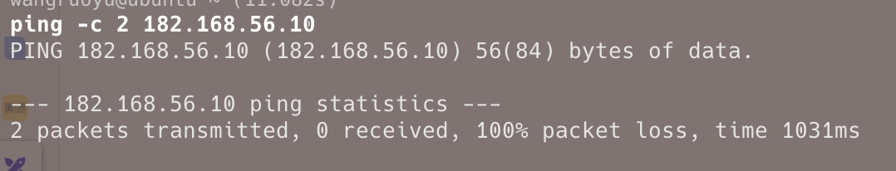

若要在根命名空间和容器命名空间之间建立连接，我们需要将 IP 地址分配给桥接网络接口：
```shell
sudo ip addr add 198.19.249.100/24 dev br0
```

---

# 10、与外界联系

我们现在可以ping通新建的命名空间了
```shell
ping -c 2 192.168.56.10
```
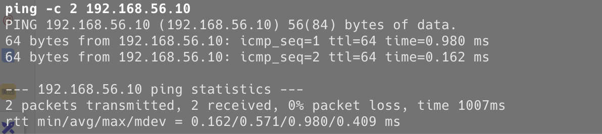

命名空间仍然无法联系到主机的. 为此，我们需要添加eth0默认路由到容器的路由表：
```shell
sudo nsenter --net=/run/netns/netns0 \
  ip route add default via 192.168.56.1  # i.e. via the bridge interface

sudo nsenter --net=/run/netns/netns1 \
  ip route add default via 192.168.56.1  # i.e. via the bridge interface
```
可以验证一下：
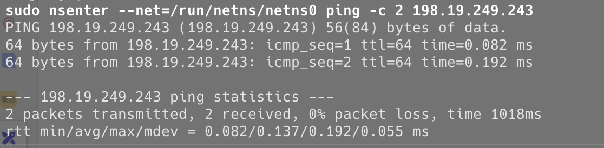 

---
layout: center

---

# THANKS!